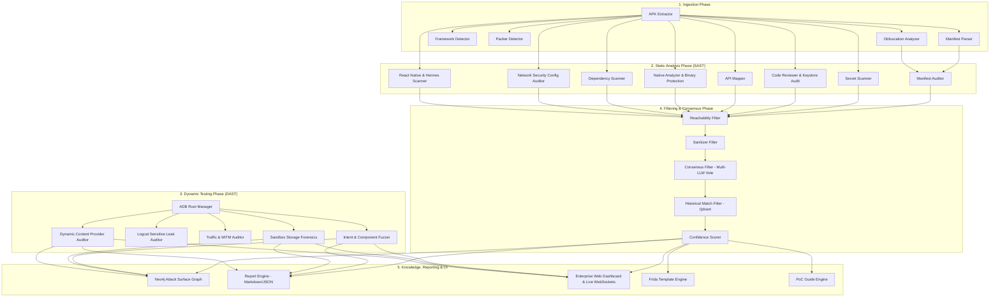

# MobileAg Architecture & Component Map

## Overview
MobileAg is an enterprise mobile application security analysis framework combining static code analysis (SAST), dynamic application security testing (DAST) on live/rooted Android environments, multi-model LLM consensus auditing, and real-time AppSec dashboard visualization.



---

## Directory Structure

```
Mobile_Ag/
├── config/                  # Configuration & LLM Provider Routing
│   ├── llm_config.py
│   └── settings.py
├── data/                    # CWE, MASVS & Signature Reference Databases
│   ├── cwe_database.json
│   ├── known_packers.json
│   └── masvs_mapping.json
├── mobileag/
│   ├── analysis/            # Security Analysis Modules (SAST)
│   │   ├── api_mapper.py
│   │   ├── binary_protection_auditor.py
│   │   ├── code_reviewer.py
│   │   ├── dependency_scanner.py
│   │   ├── manifest_auditor.py
│   │   ├── native_analyzer.py
│   │   ├── network_security_config_auditor.py
│   │   ├── react_native_scanner.py
│   │   └── secret_scanner.py
│   ├── core/                # Pipeline Orchestration & State Management
│   │   ├── orchestrator.py
│   │   └── state.py
│   ├── dast/                # Dynamic Application Security Testing (DAST)
│   │   ├── adb_manager.py
│   │   ├── intent_fuzzer.py
│   │   ├── logcat_auditor.py
│   │   ├── provider_auditor.py
│   │   ├── storage_auditor.py
│   │   └── traffic_auditor.py
│   ├── diffing/             # APK Version Differential Analysis
│   │   └── version_diff.py
│   ├── filters/             # 5-Layer False-Positive Elimination Pipeline
│   │   ├── confidence.py
│   │   ├── consensus_vote.py
│   │   ├── historical_match.py
│   │   ├── pipeline.py
│   │   ├── reachability.py
│   │   └── sanitizer_check.py
│   ├── generators/          # Script & Guide Templating Engines
│   │   ├── frida_generator.py
│   │   ├── poc_generator.py
│   │   └── templates/
│   ├── ingestion/           # Extraction & Decompilation Parsers
│   │   ├── apk_extractor.py
│   │   ├── framework_detector.py
│   │   ├── manifest_parser.py
│   │   ├── obfuscation.py
│   │   └── packer_detector.py
│   ├── knowledge/           # Graph & Vector Database Integration
│   │   ├── feedback.py
│   │   ├── neo4j_graph.py
│   │   ├── qdrant_store.py
│   │   └── schemas.py
│   ├── llm/                 # Multi-LLM Provider Adaptors
│   │   ├── consensus.py
│   │   ├── fallback.py
│   │   ├── router.py
│   │   └── providers/
│   ├── reporting/           # Report Compilation & Formatting
│   │   ├── cvss.py
│   │   ├── finding.py
│   │   ├── masvs.py
│   │   └── report_engine.py
│   └── web/                 # Enterprise Web Security Dashboard
│       ├── app.py
│       └── templates/
│           └── index.html
├── tests/                   # Automated Unit & Integration Test Suite
├── docker-compose.yml       # Neo4j & Qdrant Services setup
├── pyproject.toml           # Project Dependencies
└── README.md                # Project Overview & Setup Instructions
```

---

## Phase Breakdown

| Phase | Component | Responsibilities |
|---|---|---|
| **Phase 1** | Configuration & Router | Multi-provider routing (Gemini, GPT, Claude, DeepSeek, Grok), state initialization, CVSS 3.1 calculation. |
| **Phase 2** | Ingestion & Analysis (SAST) | Decompilation, manifest auditing, hardcoded key scanning, code review, Keystore specifications, network security config, native binary protections (canaries/NX/PIE), dependency scanning. |
| **Phase 3** | Dynamic Testing (DAST) | Rooted emulator/device interaction (`su -c`), component & intent boundary fuzzing with hybrid extra key binding, logcat sensitive leak audits, traffic caching/cleartext inspection, sandbox storage forensics (`/data/data/<pkg>`), and Content Provider exploitation checks. |
| **Phase 4** | Filtering & Knowledge | 5-layer false positive elimination (Reachability, Sanitizer, Consensus, Vector similarity, Scorer), Neo4j attack graph, Qdrant vector memory. |
| **Phase 5** | Orchestration, UI & Output | Central orchestrator, version diffing (`v1` vs `v2`), Markdown/JSON report engine, interactive Web Security Dashboard with real-time WebSockets, and CLI interface. |
